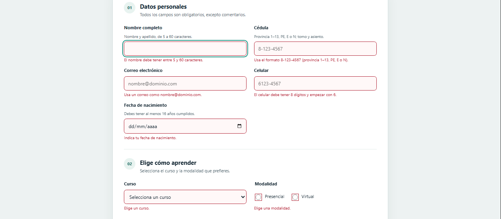
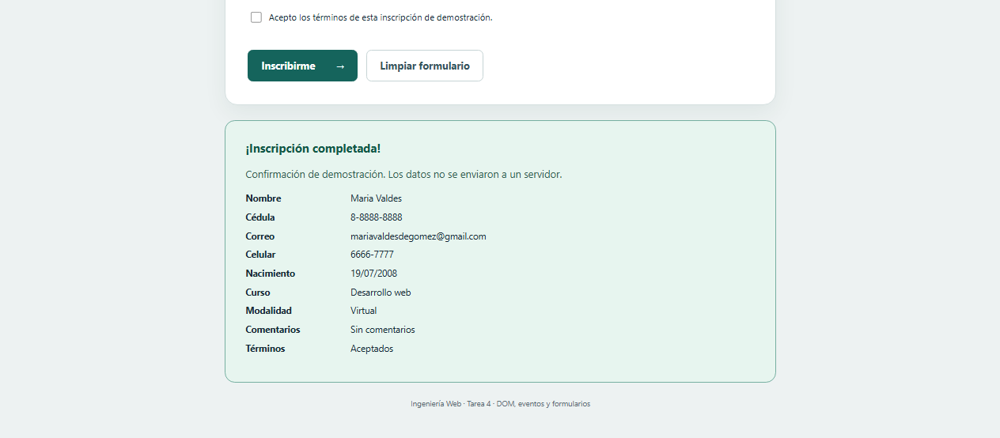

# Inscripción a cursos — DOM, eventos y formularios

**Estudiantes:** Abraham Gómez - Emmanuel Hernandez
**Grupo:** #11
**Asignatura:** Ingeniería Web — Laboratorio Avanzado JS: DOM, Eventos y Validación de formularios 
**Universidad:** Universidad Tecnológica de Panamá

## Enlaces de entrega

- Repositorio: https://github.com/sieteno/tarea-4-ing-web
- Página publicada: https://sieteno.github.io/tarea-4-ing-web/inscripcion/

## Descripción

Formulario de inscripción a cursos de la Facultad de Ingeniería de Sistemas Computacionales. Desarrollado con HTML, CSS y JavaScript puro, sin librerías ni dependencias. Es una demostración: no envía ni almacena datos y no crea una inscripción real.

## Archivos

- `index.html`: entrada que redirige al formulario; permite abrir la dirección principal de GitHub Pages.
- `inscripcion/index.html`: campos, mensajes accesibles y contenedor de confirmación.
- `inscripcion/estilos.css`: diseño adaptable a dispositivos móviles.
- `inscripcion/validacion.js`: reglas, eventos y creación de la tarjeta de confirmación.
- `capturas/`: carpeta destinada a las dos evidencias de funcionamiento.
- `INSTRUCCIONES.md`: pasos para probar, publicar y entregar.

## Funcionamiento

Las reglas están centralizadas en el objeto `reglas`. La función `validarCampo` aplica la regla correspondiente y actualiza el mensaje y `aria-invalid`. El conjunto `tocados` permite validar al salir del campo y después al editarlo. Al enviar, se comprueban todos los campos activos y se enfoca el primer error.

La sede solo se habilita y valida en modalidad presencial. La contraseña incluye un indicador de fuerza y la confirmación se revalida cuando cambia la original. Los comentarios tienen un contador con advertencia al superar 180 caracteres; se permite escribir más de 200 para mostrar el error e impedir el envío.

La confirmación usa `createElement` y `textContent`, excluye las contraseñas y permanece visible después de reiniciar el formulario. El botón Limpiar también elimina la confirmación anterior.

## Ejecutar localmente

Abrir `inscripcion/index.html` en un navegador moderno. No se requiere instalar paquetes ni usar un servidor.

## Evidencias

### 1. Validación de campos incorrectos

### 2. Confirmación de inscripción

